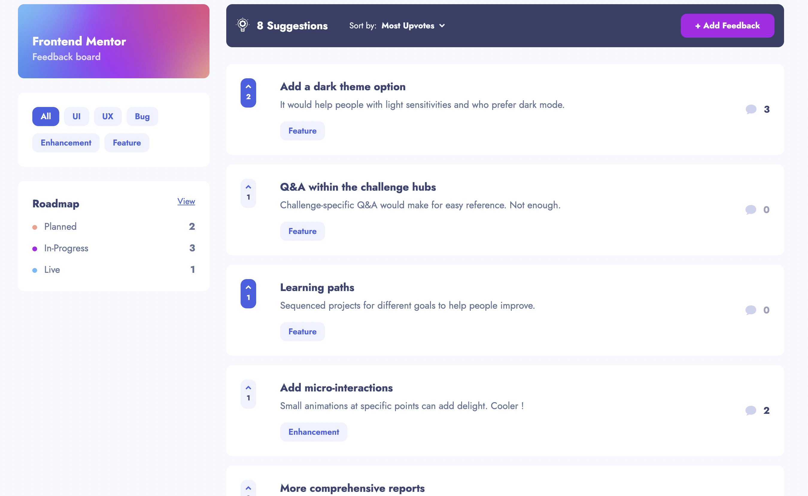
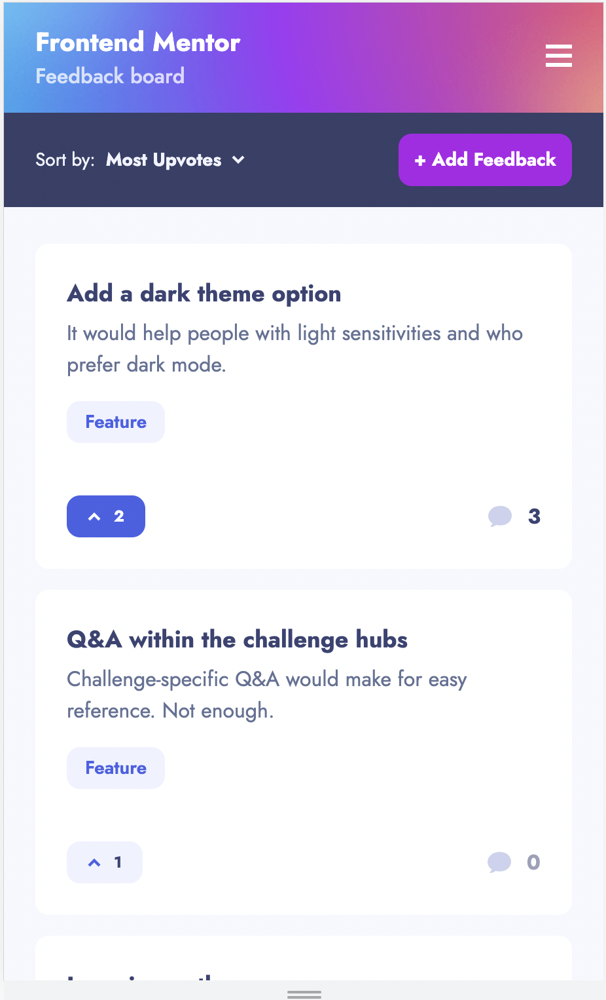

# Frontend Mentor - Product feedback app solution

This is a solution to the [Product feedback app challenge on Frontend Mentor](https://www.frontendmentor.io/challenges/product-feedback-app-wbvUYqjR6), for my personal Frontend Training routine.

## Table of contents

- [Frontend Mentor - Product feedback app solution](#frontend-mentor---product-feedback-app-solution)
  - [Table of contents](#table-of-contents)
  - [Overview](#overview)
    - [The challenge](#the-challenge)
    - [Screenshot](#screenshot)
      - [Desktop](#desktop)
      - [Mobile](#mobile)
    - [Links](#links)
  - [My process](#my-process)
    - [Built with](#built-with)
    - [What I learned](#what-i-learned)
    - [Continued development](#continued-development)
  - [Author](#author)
  - [Author](#author-1)
  - [Acknowledgments](#acknowledgments)

## Overview

### The challenge

Users should be able to:

- View the optimal layout for the app depending on their device's screen size
- See hover states for all interactive elements on the page
- Create, read, update, and delete product feedback requests
- Receive form validations when trying to create/edit feedback requests
- Sort suggestions by most/least upvotes and most/least comments
- Filter suggestions by category
- Add comments and replies to a product feedback request
- Upvote product feedback requests
- **Bonus**: Keep track of any changes, even after refreshing the browser (`localStorage` could be used for this if you're not building out a full-stack app)

### Screenshot

#### Desktop

#### Mobile

### Links

- Solution URL: [https://github.com/PhilDL/product-feedback-app](https://github.com/PhilDL/product-feedback-app)
- Live Site URL: [https://product-feedback-app-phildl.vercel.app](https://product-feedback-app-phildl.vercel.app)

## My process

### Built with

- Semantic HTML5 markup
- Flexbox
- Mobile-first workflow
- Accessibility
- [React](https://reactjs.org/) - JS library
- [Next.js](https://nextjs.org/) - React framework
- [SWR](https://swr.vercel.app/) - React Hooks for Data Fetching
- [TailwindCSS 3](https://tailwindcss.com/) - For styles
- [Supabase](https://supabase.com/) - For Database
- [Storybook](https://storybook.js.org) - Storybook: UI component explorer for frontend developers

### What I learned

I wasn't sure wich technology between Remix and NextJS to practice/learn so i begin by doing a Design System of React components with StoryBook and Tailwind (easier to migrate between Next and Remix, i also wanted to use something else than styled components). The goal was to make a Fullstack App.

Storybook was kind of easy to use then i dived head first and choose NextJS, for full stack effect i added Supabase, so i learned quite a lot. Using SWR to make NextJS more "dynamic" in this kind of app with a lot of interactions was essential to me.

The thing i'm most proud about is how i handle the thin grey left line when inside a Comments reply chain!

### Continued development

- I would like to make some refactoring into hooks to clean up code.
- Storybook is now broken, some of the Components need special Context and i'm not proud about that. I would like them to be the most presentationnal possible but i still need some work.

## Author

- Website - [Add your name here](https://www.your-site.com)
- Frontend Mentor - [@yourusername](https://www.frontendmentor.io/profile/yourusername)
- Twitter - [@yourusername](https://www.twitter.com/yourusername)

**Note: Delete this note and add/remove/edit lines above based on what links you'd like to share.**

## Author

- Website - [Coding Dodo](https://codingdodo.com)
- Twitter - [@_philDL_](https://twitter.com/_philDL)

## Acknowledgments

Thanks to Josh from the [CSS For JS Dev course](https://courses.joshwcomeau.com/css-for-js) for this amazing ressource.